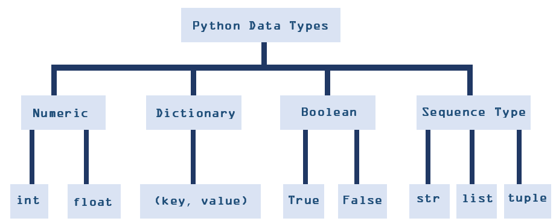

 
 

    
    <h1 align="center">📝 Data Structures and Algorithms Notes with Python</h1>
    
By Eliana Lopez

This repository contains a deep dive on Data Structures and Algorithms theory and concepts along with Python based examples of many popular algorithms and data structures.

## Introduction and the Basics

### What is an Algorithm
Overall this is the most intuitive definition  of an algorithm:

* A set of instructions used to solved a problem
 
Outside of computing, one example of an algorithm can be a recipe from a cookbook to craft a meal. Where we follow a certain set of instruction from the cook book to create our meal, which would thus solve the problem of our hunger. 

### What is a Data Structure

* A data structure is a format for accessing, storing, organizing, or structuring data.

Overall it is a technique of how data can inter-relate to each other logically or mathematically. 

#### Data Structures need Algorithms and Algorithms need Data Structures
**The connection between algorithms and data structures is that an algorithm processes data and that data is then stored into a data structure.**

### Data Type
Data types are important because they illustrate the kind of value in the variable and tells us what operations can be performed on any particular data. Down below is an intuitive definition  of what a data type is:

* An attribute of data that informs the interper on how to classify the variable. 

In Python there are four categories of data types: *numeric, squential, booleans, and dictonary* 
I have created a diagram of these categories of data types along with their respective data types down below.

### Abstract Data Types (ADT)
*
**ADT gives us the blue print while a data structure tells us how to implement it**

### Big-O Notation 

